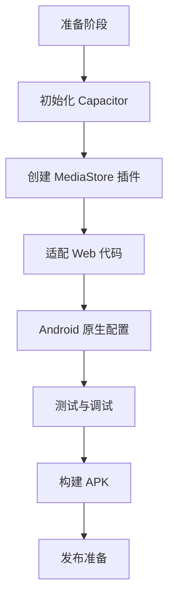

# Capacitor Android 迁移指南

## 📱 项目概述

本文档详细说明如何将 **lrc-player** Web 应用迁移为基于 **Capacitor** 框架的 Android 原生应用，使用 **MediaStore API** 管理音频文件。

- **目标平台**: Android 10+ (API Level 29+)
- **核心功能**: 歌词播放、简谱转调、歌词编辑与同步
- **文件管理**: MediaStore API（系统媒体库）
- **Capacitor 版本**: 6.x+

---

## 🎯 迁移目标

### 核心原则：Web 与 Android 共存 + 完全离线

**重要**: 
1. 本次迁移必须保证 **Web 版本完全不受影响**，所有改动都是**增量式**的。
2. **Android App 必须是完全离线版本**，不依赖网络连接即可使用所有核心功能。

#### 双端架构设计

```
lrc-player/
├── Web 版本 (原有功能)
│   ├── 文件选择: <input type="file" />
│   ├── 播放列表: selected-files-panel (现有)
│   └── 运行环境: 浏览器
│
└── Android 版本 (新增)
    ├── 文件选择: MediaStore API
    ├── 播放列表: MSselected-files-panel (新增)
    └── 运行环境: Capacitor WebView
```

#### 平台检测与分支逻辑

```typescript
// 检测是否在 Capacitor 环境中
import { Capacitor } from '@capacitor/core';

const isNativePlatform = Capacitor.isNativePlatform();
const platform = Capacitor.getPlatform(); // 'android' | 'ios' | 'web'

// 根据平台显示不同的 UI
if (isNativePlatform && platform === 'android') {
  // 显示 Android 特定的 UI
  showMSSelectedFilesPanel();
} else {
  // 显示 Web 版本的 UI
  showWebSelectedFilesPanel();
}
```

### 关键 UI 组件的平台适配

#### 1. file-list-btn 按钮行为

| 平台 | 点击行为 | 打开面板 |
|------|---------|----------|
| **Web** | 打开文件选择器 | `selected-files-panel` (现有) |
| **Android** | 打开音乐库 | `MSselected-files-panel` (新增) |

**实现示例：**
```typescript
// header.tsx
<button 
  className="file-list-btn"
  onClick={() => {
    if (isAndroidNative()) {
      setShowMSPanel(true);  // Android: 打开音乐库
    } else {
      setShowWebPanel(true);  // Web: 打开文件列表
    }
  }}
>
  {isAndroidNative() ? '📁 音乐库' : '📁 文件列表'}
</button>
```

#### 2. MSselected-files-panel 功能

**Android 专属功能：**
- ✅ **授权管理** - 请求存储权限
- ✅ **添加文件夹** - 选择扫描的音乐文件夹
- ✅ **播放列表** - 显示 MediaStore 扫描结果
- ✅ **刷新媒体库** - 触发系统媒体扫描
- ✅ **元数据显示** - 标题、艺术家、专辑、时长

**Web 版本不显示此面板**，继续使用原有的 `selected-files-panel`。

#### 3. 代码隔离原则

```typescript
// ✅ 正确：使用平台检测隔离代码
import { isAndroidNative } from '../utils/platform-detector';

if (isAndroidNative()) {
  // Android 特定逻辑
  const tracks = await AudioFileAdapter.loadAudioFiles();
} else {
  // Web 逻辑（原有）
  const files = await fileInputRef.current?.files;
}

// ❌ 错误：直接修改原有 Web 逻辑
// 不要破坏现有的 Web 功能！
```

### 核心优势
✅ **永久文件访问** - 通过 MediaStore Content URI 持久化访问音频文件  
✅ **自动扫描** - 自动发现用户音乐文件夹中的音频文件  
✅ **元数据完整** - 系统提供标题、艺术家、专辑等完整信息  
✅ **符合规范** - 完全遵循 Android Scoped Storage 要求  
✅ **Google Play 友好** - 无需特殊权限，审核通过率高  
✅ **Web 兼容** - Web 版本功能完全保留，互不影响  
✅ **完全离线** - 所有核心功能无需网络即可使用  

### 技术选型理由
相比 SAF (Storage Access Framework)，选择 MediaStore 的原因：
- ✅ 用户体验更好（零配置，自动扫描）
- ✅ 实现更简单（已有插件基础）
- ✅ 符合音乐播放器使用习惯
- ❌ 局限性：只能访问系统媒体库索引的文件

---

## 📋 迁移步骤总览



---

## 1️⃣ 准备阶段

### 1.1 环境要求

```bash
# Node.js 版本
node >= 18.0.0

# npm/pnpm 版本
npm >= 9.0.0
# 或
pnpm >= 8.0.0

# Java JDK
JDK 17+

# Android Studio
Android Studio Hedgehog+ (2023.1.1+)

# Android SDK
- Platform: Android 14 (API 34)
- Build Tools: 34.0.0+
- Platform Tools: 34.0.0+
```

### 1.2 安装 Android Studio

1. 下载并安装 [Android Studio](https://developer.android.com/studio)
2. 打开 Android Studio，进入 **SDK Manager**
3. 安装以下组件：
   - ✅ Android SDK Platform 34 (Android 14)
   - ✅ Android SDK Build-Tools 34.0.0
   - ✅ Android SDK Platform-Tools
   - ✅ Android Emulator（可选，用于测试）

### 1.3 配置环境变量

```bash
# macOS/Linux (~/.zshrc 或 ~/.bashrc)
export ANDROID_HOME=$HOME/Library/Android/sdk
export PATH=$PATH:$ANDROID_HOME/platform-tools
export PATH=$PATH:$ANDROID_HOME/build-tools/34.0.0

# 验证配置
echo $ANDROID_HOME
adb version
```

---

## 2️⃣ 初始化 Capacitor

### 2.1 安装 Capacitor 核心包

```bash
cd /Volumes/data/lingmaProjects/lrc-player

# 安装 Capacitor 核心
npm install @capacitor/core @capacitor/cli @capacitor/android

# 或使用 pnpm
pnpm add @capacitor/core @capacitor/cli @capacitor/android
```

### 2.2 初始化 Capacitor 配置

```bash
# 初始化 Capacitor
npx cap init "LRC Player" com.lrcplayer.app --web-dir=build

# 这会创建 capacitor.config.ts 文件
```

### 2.3 配置 capacitor.config.ts

```typescript
import { CapacitorConfig } from '@capacitor/cli';

const config: CapacitorConfig = {
  appId: 'com.lrcplayer.app',
  appName: 'LRC Player',
  webDir: 'build',  // Vite 构建输出目录
  server: {
    androidScheme: 'https',  // 使用 HTTPS 协议
    cleartext: false,  // 禁止明文流量
  },
  android: {
    buildOptions: {
      keystorePath: undefined,  // 调试时不需要
      keystorePassword: undefined,
      keystoreAlias: undefined,
    },
    allowMixedContent: true,  // 允许混合内容（开发阶段）
    captureInput: true,  // 捕获输入事件
    webContentsDebuggingEnabled: true,  // 启用 Web 内容调试
  },
  plugins: {
    // 后续添加插件配置
  },
};

export default config;
```

### 2.4 修改 package.json 脚本

```json
{
  "scripts": {
    "start": "vite",
    "build": "vite build",
    "cap:sync": "npx cap sync",
    "cap:android": "npx cap open android",
    "cap:run:android": "npm run build && npx cap sync && npx cap run android",
    "cap:build:android": "npm run build && npx cap sync && cd android && ./gradlew assembleRelease"
  }
}
```

### 2.5 添加 Android 平台

```bash
# 添加 Android 平台
npx cap add android

# 这会创建 android/ 目录
```

---

## 3️⃣ 创建 MediaStore Capacitor 插件

### 3.1 插件结构设计

```
android/app/src/main/java/com/lrcplayer/app/
├── plugins/
│   ├── MediaStorePlugin.java          # 主插件类
│   ├── AudioScanner.java              # 音频扫描器
│   └── MediaStoreHelper.java          # MediaStore 辅助类
```

### 3.2 创建 MediaStorePlugin.java

```java
package com.lrcplayer.app.plugins;

import android.content.ContentResolver;
import android.content.Context;
import android.database.Cursor;
import android.net.Uri;
import android.provider.MediaStore;
import android.util.Log;

import com.getcapacitor.JSArray;
import com.getcapacitor.JSObject;
import com.getcapacitor.Plugin;
import com.getcapacitor.PluginCall;
import com.getcapacitor.PluginMethod;
import com.getcapacitor.annotation.CapacitorPlugin;

import java.io.File;
import java.util.ArrayList;
import java.util.HashMap;
import java.util.List;
import java.util.Map;

@CapacitorPlugin(name = "MediaStore")
public class MediaStorePlugin extends Plugin {
    
    private static final String TAG = "MediaStorePlugin";
    
    @PluginMethod
    public void getAudioTracks(PluginCall call) {
        try {
            String folderPath = call.getString("folder", "/storage/emulated/0/Music");
            JSArray tracks = scanAudioFiles(folderPath);
            
            JSObject result = new JSObject();
            result.put("tracks", tracks);
            result.put("count", tracks.length());
            
            call.resolve(result);
        } catch (Exception e) {
            Log.e(TAG, "Error scanning audio files", e);
            call.reject("Failed to scan audio files: " + e.getMessage());
        }
    }
    
    @PluginMethod
    public void refreshLibrary(PluginCall call) {
        try {
            String folderPath = call.getString("folder", "/storage/emulated/0/Music");
            boolean success = triggerMediaScan(folderPath);
            
            JSObject result = new JSObject();
            result.put("success", success);
            
            call.resolve(result);
        } catch (Exception e) {
            Log.e(TAG, "Error refreshing library", e);
            call.reject("Failed to refresh library: " + e.getMessage());
        }
    }
    
    private JSArray scanAudioFiles(String folderPath) {
        JSArray tracks = new JSArray();
        Context context = getContext();
        ContentResolver resolver = context.getContentResolver();
        
        // 查询条件
        String selection = MediaStore.Audio.Media.IS_MUSIC + " != 0";
        String[] projection = {
            MediaStore.Audio.Media._ID,
            MediaStore.Audio.Media.TITLE,
            MediaStore.Audio.Media.ARTIST,
            MediaStore.Audio.Media.ALBUM,
            MediaStore.Audio.Media.DURATION,
            MediaStore.Audio.Media.DATA,
            MediaStore.Audio.Media.SIZE,
            MediaStore.Audio.Media.DATE_ADDED
        };
        
        Cursor cursor = resolver.query(
            MediaStore.Audio.Media.EXTERNAL_CONTENT_URI,
            projection,
            selection,
            null,
            MediaStore.Audio.Media.TITLE + " ASC"
        );
        
        if (cursor != null) {
            int idIndex = cursor.getColumnIndex(MediaStore.Audio.Media._ID);
            int titleIndex = cursor.getColumnIndex(MediaStore.Audio.Media.TITLE);
            int artistIndex = cursor.getColumnIndex(MediaStore.Audio.Media.ARTIST);
            int albumIndex = cursor.getColumnIndex(MediaStore.Audio.Media.ALBUM);
            int durationIndex = cursor.getColumnIndex(MediaStore.Audio.Media.DURATION);
            int dataIndex = cursor.getColumnIndex(MediaStore.Audio.Media.DATA);
            int sizeIndex = cursor.getColumnIndex(MediaStore.Audio.Media.SIZE);
            int dateAddedIndex = cursor.getColumnIndex(MediaStore.Audio.Media.DATE_ADDED);
            
            while (cursor.moveToNext()) {
                String filePath = cursor.getString(dataIndex);
                
                // 过滤：只包含指定文件夹的文件
                if (filePath != null && filePath.startsWith(folderPath)) {
                    JSObject track = new JSObject();
                    
                    long id = cursor.getLong(idIndex);
                    String uri = "content://media/external/audio/media/" + id;
                    
                    track.put("id", id);
                    track.put("uri", uri);
                    track.put("title", cursor.getString(titleIndex));
                    track.put("artist", cursor.getString(artistIndex));
                    track.put("album", cursor.getString(albumIndex));
                    track.put("duration", cursor.getInt(durationIndex) / 1000); // 转换为秒
                    track.put("path", filePath);
                    track.put("size", cursor.getLong(sizeIndex));
                    track.put("dateAdded", cursor.getLong(dateAddedIndex));
                    
                    tracks.put(track);
                }
            }
            cursor.close();
        }
        
        return tracks;
    }
    
    private boolean triggerMediaScan(String folderPath) {
        try {
            File folder = new File(folderPath);
            if (!folder.exists() || !folder.isDirectory()) {
                return false;
            }
            
            // 触发媒体扫描
            Intent mediaScanIntent = new Intent(Intent.ACTION_MEDIA_SCANNER_SCAN_FILE);
            Uri contentUri = Uri.fromFile(folder);
            mediaScanIntent.setData(contentUri);
            getContext().sendBroadcast(mediaScanIntent);
            
            return true;
        } catch (Exception e) {
            Log.e(TAG, "Error triggering media scan", e);
            return false;
        }
    }
}
```

### 3.3 注册插件

在 `android/app/src/main/java/com/lrcplayer/app/MainActivity.java` 中注册：

```java
package com.lrcplayer.app;

import com.getcapacitor.BridgeActivity;
import com.lrcplayer.app.plugins.MediaStorePlugin;

public class MainActivity extends BridgeActivity {
    @Override
    public void onCreate() {
        super.onCreate();
        
        // 注册自定义插件
        registerPlugin(MediaStorePlugin.class);
    }
}
```

### 3.4 创建 TypeScript 接口

在 `src/utils/mediastore-plugin.ts` 中：

```typescript
import { registerPlugin } from '@capacitor/core';

export interface AudioTrack {
  id: number;
  uri: string;           // content:// URI
  title: string;
  artist: string;
  album: string;
  duration: number;      // 秒
  path: string;          // 文件路径
  size: number;          // 字节
  dateAdded: number;     // Unix 时间戳
}

export interface MediaStorePlugin {
  getAudioTracks(options?: { folder?: string }): Promise<{
    tracks: AudioTrack[];
    count: number;
  }>;
  
  refreshLibrary(options?: { folder?: string }): Promise<{
    success: boolean;
  }>;
}

const MediaStore = registerPlugin<MediaStorePlugin>('MediaStore');

export { MediaStore };
```

---

## 4️⃣ 适配 Web 代码

### 4.0 平台检测工具

在 `src/utils/platform-detector.ts` 中创建平台检测工具：

```typescript
import { Capacitor } from '@capacitor/core';

export interface PlatformInfo {
  isNative: boolean;
  platform: 'android' | 'ios' | 'web';
  isAndroid: boolean;
  isIOS: boolean;
  isWeb: boolean;
}

/**
 * 获取当前平台信息
 */
export function getPlatformInfo(): PlatformInfo {
  const isNative = Capacitor.isNativePlatform();
  const platform = Capacitor.getPlatform() as 'android' | 'ios' | 'web';
  
  return {
    isNative,
    platform,
    isAndroid: isNative && platform === 'android',
    isIOS: isNative && platform === 'ios',
    isWeb: !isNative || platform === 'web',
  };
}

/**
 * 便捷函数：是否在 Android 原生环境
 */
export function isAndroidNative(): boolean {
  return getPlatformInfo().isAndroid;
}

/**
 * 便捷函数：是否在 Web 环境
 */
export function isWebEnvironment(): boolean {
  return getPlatformInfo().isWeb;
}
```

### 4.1 创建音频文件适配器

在 `src/utils/audio-file-adapter.ts` 中：

```typescript
import { MediaStore, type AudioTrack } from './mediastore-plugin';

export class AudioFileAdapter {
  /**
   * 从 MediaStore 加载音频文件列表
   */
  static async loadAudioFiles(folder?: string): Promise<AudioTrack[]> {
    try {
      const result = await MediaStore.getAudioTracks({ folder });
      console.log(`Loaded ${result.count} audio tracks`);
      return result.tracks;
    } catch (error) {
      console.error('Failed to load audio files:', error);
      return [];
    }
  }
  
  /**
   * 将 Content URI 转换为 File 对象（用于 Web Audio API）
   */
  static async uriToFile(uri: string): Promise<File> {
    try {
      // 在 Capacitor 环境中，需要通过原生桥接读取文件
      const response = await fetch(uri);
      const blob = await response.blob();
      
      // 从 URI 提取文件名
      const fileName = uri.split('/').pop() || 'audio.mp3';
      
      return new File([blob], fileName, { type: blob.type });
    } catch (error) {
      console.error('Failed to convert URI to File:', error);
      throw error;
    }
  }
  
  /**
   * 刷新媒体库
   */
  static async refreshLibrary(folder?: string): Promise<boolean> {
    try {
      const result = await MediaStore.refreshLibrary({ folder });
      return result.success;
    } catch (error) {
      console.error('Failed to refresh library:', error);
      return false;
    }
  }
}
```

### 4.2 创建 Android 特定的播放列表面板

在 `src/components/MSselected-files-panel.tsx` 中创建新的播放列表面板：

```typescript
import React, { useState, useEffect } from 'react';
import { AudioFileAdapter } from '../utils/audio-file-adapter';
import { isAndroidNative } from '../utils/platform-detector';
import type { AudioTrack } from '../utils/mediastore-plugin';

interface MSSelectedFilesPanelProps {
  onPlayTrack: (track: AudioTrack) => void;
  onClose: () => void;
}

export const MSSelectedFilesPanel: React.FC<MSSelectedFilesPanelProps> = ({
  onPlayTrack,
  onClose,
}) => {
  const [tracks, setTracks] = useState<AudioTrack[]>([]);
  const [isScanning, setIsScanning] = useState(false);
  const [selectedFolder, setSelectedFolder] = useState('/storage/emulated/0/Music');
  
  // 只在 Android 原生环境中渲染
  if (!isAndroidNative()) {
    return null;
  }
  
  // 扫描音乐文件夹
  const scanFolder = async () => {
    setIsScanning(true);
    try {
      const audioTracks = await AudioFileAdapter.loadAudioFiles(selectedFolder);
      setTracks(audioTracks);
    } catch (error) {
      console.error('扫描失败:', error);
    } finally {
      setIsScanning(false);
    }
  };
  
  // 刷新媒体库
  const refreshLibrary = async () => {
    const success = await AudioFileAdapter.refreshLibrary(selectedFolder);
    if (success) {
      // 等待几秒后重新扫描
      setTimeout(scanFolder, 2000);
    }
  };
  
  useEffect(() => {
    // 组件挂载时自动扫描
    scanFolder();
  }, []);
  
  return (
    <div className="ms-selected-files-panel">
      <div className="panel-header">
        <h3>🎵 音乐库</h3>
        <button onClick={onClose}>✕</button>
      </div>
      
      <div className="panel-controls">
        <button 
          onClick={scanFolder} 
          disabled={isScanning}
          className="scan-button"
        >
          {isScanning ? '扫描中...' : '🔍 重新扫描'}
        </button>
        
        <button 
          onClick={refreshLibrary}
          className="refresh-button"
        >
          🔄 刷新媒体库
        </button>
      </div>
      
      <div className="folder-selector">
        <label>扫描文件夹:</label>
        <input 
          type="text" 
          value={selectedFolder}
          onChange={(e) => setSelectedFolder(e.target.value)}
          placeholder="/storage/emulated/0/Music"
        />
      </div>
      
      <div className="tracks-list">
        {tracks.length === 0 ? (
          <div className="empty-state">
            <p>未找到音频文件</p>
            <p className="hint">请将音乐文件放入音乐文件夹，然后点击“刷新媒体库”</p>
          </div>
        ) : (
          tracks.map((track) => (
            <div 
              key={track.id} 
              className="track-item"
              onClick={() => onPlayTrack(track)}
            >
              <div className="track-info">
                <div className="track-title">{track.title || '未知标题'}</div>
                <div className="track-artist">{track.artist || '未知艺术家'}</div>
                <div className="track-meta">
                  <span>{formatDuration(track.duration)}</span>
                  <span>{formatFileSize(track.size)}</span>
                </div>
              </div>
              <div className="track-play-icon">▶️</div>
            </div>
          ))
        )}
      </div>
      
      <div className="panel-footer">
        <span>共 {tracks.length} 首歌曲</span>
      </div>
    </div>
  );
};

// 辅助函数
function formatDuration(seconds: number): string {
  const mins = Math.floor(seconds / 60);
  const secs = seconds % 60;
  return `${mins}:${secs.toString().padStart(2, '0')}`;
}

function formatFileSize(bytes: number): string {
  const mb = bytes / (1024 * 1024);
  return `${mb.toFixed(1)} MB`;
}
```

### 4.3 修改 header.tsx - 平台特定按钮

```typescript
// src/components/header.tsx

import { isAndroidNative } from '../utils/platform-detector';
import { MSSelectedFilesPanel } from './MSselected-files-panel';

// 在 Header 组件中
export const Header: React.FC = () => {
  const [showMSPanel, setShowMSPanel] = useState(false);
  
  // 处理播放选中的曲目
  const handlePlayTrack = async (track: AudioTrack) => {
    try {
      const audioFile = await AudioFileAdapter.uriToFile(track.uri);
      await webAudioPlayer.init({
        audioFile,
        initialPitch: 0,
        initialSpeed: 1.0
      });
      webAudioPlayer.play();
      setShowMSPanel(false); // 关闭面板
    } catch (error) {
      console.error('播放失败:', error);
    }
  };
  
  return (
    <header className="app-header">
      {/* 其他导航按钮 */}
      
      {/* 文件列表按钮 - 根据平台显示不同功能 */}
      {isAndroidNative() ? (
        <button 
          className="file-list-btn"
          onClick={() => setShowMSPanel(true)}
          title="打开音乐库"
        >
          📁 音乐库
        </button>
      ) : (
        <button 
          className="file-list-btn"
          onClick={() => setShowWebPanel(true)}
          title="打开文件列表"
        >
          📁 文件列表
        </button>
      )}
      
      {/* Android 特定的播放列表面板 */}
      {showMSPanel && (
        <MSSelectedFilesPanel
          onPlayTrack={handlePlayTrack}
          onClose={() => setShowMSPanel(false)}
        />
      )}
      
      {/* Web 版本的播放列表面板（原有） */}
      {!isAndroidNative() && showWebPanel && (
        <WebSelectedFilesPanel
          onClose={() => setShowWebPanel(false)}
        />
      )}
    </header>
  );
};
```

### 4.4 修改 footer.tsx - 集成 MediaStore

import { AudioFileAdapter } from '../utils/audio-file-adapter';
import { webAudioPlayer } from '../utils/web-audio-player';

// 在组件中添加扫描功能
const scanMusicFolder = useCallback(async () => {
  setIsScanning(true);
  
  try {
    // 扫描默认音乐文件夹
    const tracks = await AudioFileAdapter.loadAudioFiles('/storage/emulated/0/Music');
    
    if (tracks.length === 0) {
      showToast('未找到音频文件', 'warning');
      return;
    }
    
    // 更新播放列表
    setPlaylist(tracks);
    showToast(`已加载 ${tracks.length} 首歌曲`, 'success');
    
  } catch (error) {
    console.error('扫描失败:', error);
    showToast('扫描失败，请检查权限', 'error');
  } finally {
    setIsScanning(false);
  }
}, []);

// 播放选中的曲目
const playTrack = useCallback(async (track: AudioTrack) => {
  try {
    // 将 Content URI 转换为 File
    const audioFile = await AudioFileAdapter.uriToFile(track.uri);
    
    // 初始化 Web Audio Player
    await webAudioPlayer.init({
      audioFile: audioFile,
      initialPitch: 0,
      initialSpeed: 1.0
    });
    
    // 开始播放
    webAudioPlayer.play();
    setIsPlaying(true);
    
  } catch (error) {
    console.error('播放失败:', error);
    showToast('播放失败', 'error');
  }
}, []);
```

### 4.3 添加扫描按钮到 Header

```typescript
// src/components/header.tsx

import { scanMusicFolder } from './footer';

// 在导航栏添加扫描按钮
<button 
  onClick={scanMusicFolder}
  disabled={isScanning}
  className="scan-button"
>
  {isScanning ? '扫描中...' : '🔍 扫描音乐'}
</button>
```

### 4.4 修改 player-soundtouch.tsx

```typescript
// src/components/player-soundtouch.tsx

import { AudioFileAdapter } from '../utils/audio-file-adapter';

// 修改音频初始化逻辑
useEffect(() => {
  const initializeAudio = async () => {
    if (!selectedTrack) return;
    
    try {
      // 从 MediaStore URI 加载音频
      const audioFile = await AudioFileAdapter.uriToFile(selectedTrack.uri);
      
      await webAudioPlayer.init({
        audioFile: audioFile,
        initialPitch: pitchSemitones,
        initialSpeed: playbackSpeed
      });
      
      // 设置时间更新回调
      webAudioPlayer.setTimeUpdateCallback((time: number) => {
        setCurrentTime(time);
        dispatch({ type: ActionType.refresh, payload: time });
      });
      
      setDuration(webAudioPlayer.getDuration());
      setIsAudioInitialized(true);
      
    } catch (error) {
      console.error('音频初始化失败:', error);
      showToast('音频加载失败', 'error');
    }
  };
  
  initializeAudio();
}, [selectedTrack]);
```

---

## 5️⃣ Android 原生配置

### 5.0 离线功能配置

#### 离线架构设计

```
Android App (完全离线)
├── 本地资源
│   ├── HTML/CSS/JS (打包在 APK 中)
│   ├── 字体文件
│   └── 图标资源
├── 本地数据
│   ├── MediaStore 音频文件
│   ├── Capacitor Storage (偏好设置)
│   └── IndexedDB (歌词缓存)
└── 本地处理
    ├── Web Audio API (音频播放)
    ├── SoundTouchJS (音高调节)
    └── LRC Parser (歌词解析)
```

**核心原则**：
- ✅ 所有代码和资源打包在 APK 中
- ✅ 音频文件从本地 MediaStore 读取
- ✅ 歌词文件从本地存储加载
- ✅ 所有音频处理在本地完成
- ❌ 不依赖任何外部 CDN
- ❌ 不需要网络连接

#### 禁用网络权限（可选）

如果希望**强制离线**，可以在 `AndroidManifest.xml` 中移除网络权限：

```xml
<!-- 移除以下权限以强制离线 -->
<!-- <uses-permission android:name="android.permission.INTERNET" /> -->
<!-- <uses-permission android:name="android.permission.ACCESS_NETWORK_STATE" /> -->
```

**注意**：移除网络权限后，GitHub Gist 同步功能将不可用。

#### 配置 WebView 离线模式

在 `capacitor.config.ts` 中：

```typescript
const config: CapacitorConfig = {
  appId: 'com.lrcplayer.app',
  appName: 'LRC Player',
  webDir: 'build',
  server: {
    androidScheme: 'https',
    cleartext: false,
    // ✅ 关键配置：使用本地资源
    url: undefined,  // 不使用远程 URL
  },
  android: {
    // ✅ 禁用混合内容（强制本地资源）
    allowMixedContent: false,
    // ✅ 启用本地资源调试
    webContentsDebuggingEnabled: true,
    // ✅ 捕获输入事件
    captureInput: true,
  },
};
```

### 5.1 添加权限

在 `android/app/src/main/AndroidManifest.xml` 中添加：

```xml
<manifest xmlns:android="http://schemas.android.com/apk/res/android">
    
    <!-- 读取外部存储权限 -->
    <uses-permission android:name="android.permission.READ_EXTERNAL_STORAGE" 
                     android:maxSdkVersion="32" />
    
    <!-- Android 13+ 需要的新权限 -->
    <uses-permission android:name="android.permission.READ_MEDIA_AUDIO" />
    
    <!-- 媒体扫描权限 -->
    <uses-permission android:name="android.permission.MANAGE_EXTERNAL_STORAGE" 
                     tools:ignore="ScopedStorage" />
    
    <application
        android:allowBackup="true"
        android:icon="@mipmap/ic_launcher"
        android:label="@string/app_name"
        android:roundIcon="@mipmap/ic_launcher_round"
        android:supportsRtl="true"
        android:theme="@style/AppTheme"
        android:requestLegacyExternalStorage="true">  <!-- Android 10 兼容 -->
        
        <!-- ... 其他配置 ... -->
        
    </application>
</manifest>
```

### 5.2 配置 Gradle

在 `android/app/build.gradle` 中：

```gradle
android {
    compileSdkVersion 34
    defaultConfig {
        applicationId "com.lrcplayer.app"
        minSdkVersion 29  // Android 10
        targetSdkVersion 34
        versionCode 1
        versionName "1.0.0"
    }
    
    buildTypes {
        release {
            minifyEnabled false
            proguardFiles getDefaultProguardFile('proguard-android.txt'), 'proguard-rules.pro'
        }
    }
    
    // 启用 Java 8 特性
    compileOptions {
        sourceCompatibility JavaVersion.VERSION_17
        targetCompatibility JavaVersion.VERSION_17
    }
}

dependencies {
    implementation fileTree(include: ['*.jar'], dir: 'libs')
    implementation "androidx.appcompat:appcompat:1.6.1"
    implementation "com.google.android.material:material:1.9.0"
    implementation project(':capacitor-android')
    
    // 添加其他依赖
}
```

### 5.3 请求运行时权限

在 `MainActivity.java` 中添加权限请求：

```java
package com.lrcplayer.app;

import android.Manifest;
import android.content.pm.PackageManager;
import android.os.Build;
import android.util.Log;

import androidx.core.app.ActivityCompat;
import androidx.core.content.ContextCompat;

import com.getcapacitor.BridgeActivity;
import com.lrcplayer.app.plugins.MediaStorePlugin;

public class MainActivity extends BridgeActivity {
    
    private static final String TAG = "MainActivity";
    private static final int REQUEST_CODE_PERMISSIONS = 1001;
    
    @Override
    public void onCreate() {
        super.onCreate();
        
        // 注册自定义插件
        registerPlugin(MediaStorePlugin.class);
        
        // 请求权限
        requestPermissions();
    }
    
    private void requestPermissions() {
        String[] permissions;
        
        if (Build.VERSION.SDK_INT >= Build.VERSION_CODES.TIRAMISU) {
            // Android 13+
            permissions = new String[]{
                Manifest.permission.READ_MEDIA_AUDIO
            };
        } else {
            // Android 10-12
            permissions = new String[]{
                Manifest.permission.READ_EXTERNAL_STORAGE
            };
        }
        
        // 检查是否已授予权限
        boolean allGranted = true;
        for (String permission : permissions) {
            if (ContextCompat.checkSelfPermission(this, permission) 
                    != PackageManager.PERMISSION_GRANTED) {
                allGranted = false;
                break;
            }
        }
        
        if (!allGranted) {
            ActivityCompat.requestPermissions(this, permissions, REQUEST_CODE_PERMISSIONS);
        }
    }
    
    @Override
    public void onRequestPermissionsResult(int requestCode, String[] permissions, 
                                          int[] grantResults) {
        super.onRequestPermissionsResult(requestCode, permissions, grantResults);
        
        if (requestCode == REQUEST_CODE_PERMISSIONS) {
            boolean allGranted = true;
            for (int result : grantResults) {
                if (result != PackageManager.PERMISSION_GRANTED) {
                    allGranted = false;
                    break;
                }
            }
            
            if (allGranted) {
                Log.i(TAG, "所有权限已授予");
            } else {
                Log.w(TAG, "部分权限被拒绝");
            }
        }
    }
}
```

---

## 6️⃣ 测试与调试

### 6.1 连接真机测试

```bash
# 确保手机已开启开发者模式和 USB 调试
# 连接手机后运行

# 查看连接的设备
adb devices

# 同步并运行
npm run cap:run:android
```

### 6.2 使用 Android Studio 调试

```bash
# 打开 Android Studio 项目
npx cap open android

# 在 Android Studio 中：
# 1. 点击 "Run" 按钮
# 2. 选择连接的设备或模拟器
# 3. 查看 Logcat 日志
```

### 6.3 Chrome DevTools 调试 Web 层

1. 在 Android 设备上运行应用
2. 在 Chrome 浏览器中打开 `chrome://inspect`
3. 找到你的应用，点击 "inspect"
4. 使用熟悉的 DevTools 调试 Web 代码

### 6.4 常见问题排查

#### 问题 1: 找不到音频文件

**原因**: MediaStore 数据库未更新

**解决**:
```typescript
// 手动触发媒体扫描
await AudioFileAdapter.refreshLibrary('/storage/emulated/0/Music');

// 等待几秒后重新扫描
setTimeout(async () => {
  const tracks = await AudioFileAdapter.loadAudioFiles();
  console.log('找到', tracks.length, '首歌曲');
}, 3000);
```

#### 问题 2: 权限被拒绝

**检查**:
```bash
# 查看应用权限
adb shell dumpsys package com.lrcplayer.app | grep permission
```

**解决**: 在系统设置中手动授予权限

#### 问题 3: Content URI 无法访问

**原因**: WebView 不允许直接访问 content:// URI

**解决**: 使用 `fetch()` API 转换（已在 `AudioFileAdapter.uriToFile` 中实现）

---

## 7️⃣ 构建 APK

### 7.1 调试版 APK

```bash
# 构建调试版
cd android
./gradlew assembleDebug

# APK 位置
# android/app/build/outputs/apk/debug/app-debug.apk
```

### 7.2 发布版 APK

#### 生成签名密钥

```bash
# 生成密钥库
keytool -genkey -v \
  -keystore lrc-player-release-key.jks \
  -keyalg RSA \
  -keysize 2048 \
  -validity 10000 \
  -alias lrc-player

# 按提示输入信息
```

#### 配置签名

在 `android/app/build.gradle` 中添加：

```gradle
android {
    signingConfigs {
        release {
            storeFile file('../lrc-player-release-key.jks')
            storePassword 'your-store-password'
            keyAlias 'lrc-player'
            keyPassword 'your-key-password'
        }
    }
    
    buildTypes {
        release {
            signingConfig signingConfigs.release
            minifyEnabled true
            proguardFiles getDefaultProguardFile('proguard-android.txt'), 'proguard-rules.pro'
        }
    }
}
```

#### 构建发布版

```bash
cd android
./gradlew assembleRelease

# APK 位置
# android/app/build/outputs/apk/release/app-release.apk
```

### 7.3 构建 Android App Bundle (AAB)

```bash
cd android
./gradlew bundleRelease

# AAB 位置
# android/app/build/outputs/bundle/release/app-release.aab
```

---

## 8️⃣ 发布准备

### 8.1 Google Play Console 准备

1. **创建开发者账号** ($25 一次性费用)
2. **创建应用**
   - 应用名称: LRC Player
   - 默认语言: 中文（简体）
3. **上传 AAB 文件**
4. **填写应用信息**
   - 应用描述
   - 截图（至少 2 张手机截图）
   - 图标（512x512 PNG）
   - 特色图片（1024x500 PNG）
5. **内容分级**
6. **隐私政策**（必须提供 URL）

### 8.2 隐私政策要点

```markdown
# LRC Player 隐私政策

## 数据收集
- 本应用不收集任何个人数据
- 所有数据存储在本地设备
- 不使用网络通信（除 GitHub Gist 同步功能外）

## 权限说明
- READ_MEDIA_AUDIO: 用于扫描和播放本地音频文件
- 不会上传或共享您的音频文件

## 数据存储
- 歌词和偏好设置存储在本地
- 可选择性同步到 GitHub Gist（需用户授权）
```

### 8.3 应用截图建议

1. **主界面** - 显示歌词滚动播放
2. **简谱转调** - 展示特色功能
3. **歌词编辑器** - 显示编辑界面
4. **播放列表** - 显示 MediaStore 扫描结果
5. **设置页面** - 显示偏好设置

---

## 🔧 高级配置

### 优化启动速度

在 `android/app/src/main/AndroidManifest.xml` 中：

```xml
<activity
    android:name=".MainActivity"
    android:exported="true"
    android:launchMode="singleTask"
    android:theme="@style/AppTheme.NoActionBarLaunch">
    
    <!-- 预加载优化 -->
    <meta-data
        android:name="android.app.shortcuts"
        android:resource="@xml/shortcuts" />
</activity>
```

### 添加启动画面

1. 在 `android/app/src/main/res/drawable/` 中添加 `splash_screen.xml`
2. 在 `styles.xml` 中配置主题

### 性能优化

```gradle
// android/app/build.gradle
android {
    buildFeatures {
        viewBinding true
    }
    
    packagingOptions {
        exclude 'META-INF/DEPENDENCIES'
        exclude 'META-INF/LICENSE'
        exclude 'META-INF/LICENSE.txt'
    }
}
```

---

## 📚 参考资源

- [Capacitor 官方文档](https://capacitorjs.com/docs)
- [MediaStore API 指南](https://developer.android.com/training/data-storage/shared/media)
- [Android 权限最佳实践](https://developer.android.com/guide/topics/permissions/overview)
- [Google Play 发布指南](https://developer.android.com/google/play/publish)

---

## ❓ 常见问题

### Q1: 为什么选择 MediaStore 而不是 SAF？

**A**: MediaStore 更适合音乐播放器场景：
- 自动扫描，无需用户逐个选择
- 提供完整的元数据
- 用户体验更好

SAF 适合需要精确控制文件选择的场景。

### Q2: 如何处理新下载的音频文件？

**A**: 提供"刷新媒体库"按钮，触发系统媒体扫描：
```typescript
await AudioFileAdapter.refreshLibrary();
```

### Q3: 能否访问 WhatsApp、微信等应用的音频？

**A**: 不能直接访问。这些文件不在系统媒体库中。用户可以：
1. 将文件移动到 Music 文件夹
2. 或使用 SAF 手动选择（需要额外实现）

### Q4: 如何支持更多音频格式？

**A**: MediaStore 支持系统解码器支持的所有格式。常见格式：
- ✅ MP3, AAC, FLAC, WAV, OGG
- ❌ NCM, QMC（需要解密，已在 worker 中实现）

---

## 📝 总结

通过本指南，你已经成功将 lrc-player 迁移为 Capacitor Android 应用。关键要点：

✅ **MediaStore API** 提供稳定的音频文件访问  
✅ **Capacitor 插件** 桥接 Web 和原生代码  
✅ **权限管理** 确保合规性和用户体验  
✅ **渐进式增强** 保持 Web 版本的同时提供原生体验  

下一步可以考虑：
- [ ] 添加通知栏播放控制
- [ ] 实现后台播放
- [ ] 添加桌面小部件
- [ ] 支持锁屏显示歌词

祝你的应用发布顺利！🎉

## 📊 双端架构对比图

```mermaid
graph TB
    subgraph Web环境["Web 环境 (浏览器)"]
        W1["<input type='file'>"] --> W2["File API"]
        W2 --> W3["selected-files-panel"]
        W3 --> W4["web-audio-player.ts"]
        W4 --> W5["播放歌词"]
    end
    
    subgraph Android环境["Android 环境 (Capacitor)"]
        A1["MediaStore API"] --> A2["Content URI"]
        A2 --> A3["MSselected-files-panel"]
        A3 --> A4["AudioFileAdapter"]
        A4 --> A5["URI → Blob 转换"]
        A5 --> A6["web-audio-player.ts"]
        A6 --> A7["播放歌词"]
    end
    
    subgraph 共享层["共享代码层"]
        S1["player-soundtouch.tsx"]
        S2["歌词同步器"]
        S3["简谱转调"]
        S4["偏好设置"]
    end
    
    W5 --> S1
    A7 --> S1
    S1 --> S2
    S1 --> S3
    S1 --> S4
    
    style Web环境 fill:#e1f5ff
    style Android环境 fill:#fff4e1
    style 共享层 fill:#f0f0f0
```



---

## 🌐 Web 与 Android 共存最佳实践

### 设计原则

#### 1. 零影响原则
**所有 Android 特定代码必须通过平台检测隔离，确保 Web 版本完全不受影响。**

```typescript
// ✅ 正确做法
import { isAndroidNative } from '../utils/platform-detector';

if (isAndroidNative()) {
  // 只在 Android 环境执行
  await MediaStorePlugin.getAudioTracks();
}

// ❌ 错误做法 - 会破坏 Web 版本
await MediaStorePlugin.getAudioTracks(); // Web 环境会报错！
```

#### 2. 渐进增强
**Android 功能是 Web 功能的增强，而不是替代。**

| 功能 | Web 版本 | Android 版本 |
|------|---------|-------------|
| 文件选择 | `<input type="file">` | MediaStore API |
| 播放列表 | selected-files-panel | MSselected-files-panel |
| 音频播放 | File API | Content URI → Blob |
| 权限管理 | 不需要 | 运行时请求 |

#### 3. 组件隔离
**创建独立的 Android 组件，不要修改现有 Web 组件。**

```
src/components/
├── selected-files-panel.tsx      # Web 版本（不变）
├── MSselected-files-panel.tsx    # Android 版本（新增）
├── header.tsx                     # 添加平台检测逻辑
└── footer.tsx                     # 添加平台检测逻辑
```

### 常见陷阱与解决方案

#### 陷阱 1: 忘记平台检测

```typescript
// ❌ 错误 - Web 环境会崩溃
import { MediaStore } from './mediastore-plugin';
const tracks = await MediaStore.getAudioTracks();

// ✅ 正确 - 先检测平台
import { isAndroidNative } from './platform-detector';
import { MediaStore } from './mediastore-plugin';

if (isAndroidNative()) {
  const tracks = await MediaStore.getAudioTracks();
}
```

#### 陷阱 2: 修改现有 Web 组件

```typescript
// ❌ 错误 - 直接修改 selected-files-panel.tsx
// 这会破坏 Web 版本！

// ✅ 正确 - 创建新的 MSselected-files-panel.tsx
// 保持原有组件不变
```

#### 陷阱 3: 条件渲染不当

```typescript
// ❌ 错误 - 两个面板都渲染，只是隐藏
<MSSelectedFilesPanel />
<WebSelectedFilesPanel />

// ✅ 正确 - 根据平台只渲染一个
{isAndroidNative() ? (
  <MSSelectedFilesPanel />
) : (
  <WebSelectedFilesPanel />
)}
```

### 测试策略

#### 1. Web 版本测试
```bash
# 确保 Web 版本正常工作
npm start

# 测试清单：
# ✅ 文件选择正常
# ✅ 播放列表显示正常
# ✅ 音频播放正常
# ✅ 歌词同步正常
# ✅ 简谱转调正常
```

#### 2. Android 版本测试
```bash
# 构建并运行 Android 版本
npm run cap:run:android

# 测试清单：
# ✅ 权限请求正常
# ✅ 音乐库扫描正常
# ✅ 播放列表显示正常
# ✅ 音频播放正常
# ✅ 元数据显示正常
```

#### 3. 双端对比测试

| 测试项 | Web 预期 | Android 预期 |
|--------|---------|-------------|
| 启动速度 | 快 | 稍慢（首次） |
| 文件加载 | 用户选择 | 自动扫描 |
| 播放列表 | 手动添加 | 自动填充 |
| 权限请求 | 无 | 首次启动 |
| **离线使用** | **Service Worker** | **完全离线** ✅ |

### 离线功能详解

#### 离线架构

```
Android App (完全离线)
├── 本地资源 (打包在 APK)
│   ├── HTML/CSS/JS
│   ├── 字体和图标
│   └── Web Workers
├── 本地数据
│   ├── MediaStore 音频文件
│   ├── Capacitor Storage (设置)
│   └── IndexedDB (歌词缓存)
└── 本地处理
    ├── Web Audio API
    ├── SoundTouchJS
    └── LRC Parser
```

#### 核心离线功能

✅ **完全可用的功能：**
1. **音频播放** - 从 MediaStore 读取本地音频文件
2. **歌词显示** - 本地 LRC 文件解析和滚动
3. **简谱转调** - 本地计算，无需服务器
4. **音高/速度调节** - SoundTouchJS 本地处理
5. **去人声功能** - Web Audio API 相位抵消
6. **歌词编辑** - 本地文本编辑
7. **歌词同步** - 本地打点和时间轴调整
8. **偏好设置** - Capacitor Storage 持久化
9. **播放列表** - MediaStore 扫描结果缓存

❌ **需要网络的功能（可选）：**
- GitHub Gist 同步（如保留此功能）
- 在线更新检查
- 错误报告

#### 禁用网络权限（强制离线）

如果希望**强制离线**，在 `AndroidManifest.xml` 中移除：

```xml
<!-- 注释掉或删除以下权限 -->
<!-- <uses-permission android:name="android.permission.INTERNET" /> -->
<!-- <uses-permission android:name="android.permission.ACCESS_NETWORK_STATE" /> -->
```

**效果：**
- ✅ App 无法访问网络
- ✅ 所有功能仍然正常工作
- ❌ Gist 同步功能不可用
- ❌ 无法检查更新

#### WebView 离线配置

在 `capacitor.config.ts` 中确保：

```typescript
const config: CapacitorConfig = {
  server: {
    // ✅ 使用本地资源，不加载远程 URL
    url: undefined,
    // ✅ 禁用混合内容
    allowMixedContent: false,
  },
};
```

#### 离线测试清单

```bash
# 1. 断开网络连接
# 2. 运行 App
# 3. 测试以下功能：

✅ 扫描音乐文件夹
✅ 播放音频文件
✅ 显示歌词
✅ 简谱转调
✅ 音高/速度调节
✅ 去人声功能
✅ 歌词编辑
✅ 保存偏好设置
✅ 播放列表管理

# 所有功能应该正常工作！
```

### 维护建议

#### 1. 代码组织
```
src/
├── utils/
│   ├── platform-detector.ts       # 平台检测工具
│   ├── audio-file-adapter.ts      # 音频文件适配器
│   └── mediastore-plugin.ts       # MediaStore 插件接口
├── components/
│   ├── selected-files-panel.tsx   # Web 播放列表（不变）
│   └── MSselected-files-panel.tsx # Android 播放列表（新增）
└── plugins/
    └── mediastore/                # Capacitor 插件
        ├── android/
        │   └── MediaStorePlugin.java
        └── src/
            └── definitions.ts
```

#### 2. 版本控制
```gitignore
# .gitignore
android/              # Android 原生代码（可选提交）
*.jks                 # 签名密钥（绝不提交）
local.properties      # 本地配置
```

#### 3. 文档更新
每次修改 Android 特定代码时，更新：
- ✅ `CAPACITOR-ANDROID-MIGRATION.md`
- ✅ 代码注释中标注 `// Android only`
- ✅ CHANGELOG 中记录平台特定变更

### 故障排除

#### 问题: Web 版本出现 "MediaStore is not defined"

**原因**: 忘记添加平台检测

**解决**:
```typescript
// 在所有使用 MediaStore 的地方添加检测
import { isAndroidNative } from './platform-detector';

if (isAndroidNative()) {
  // 安全使用 MediaStore
}
```

#### 问题: Android 版本显示 Web UI

**原因**: 平台检测失败

**检查**:
```typescript
console.log('Is Native:', Capacitor.isNativePlatform());
console.log('Platform:', Capacitor.getPlatform());

// 应该输出：
// Is Native: true
// Platform: 'android'
```

#### 问题: 两个面板同时显示

**原因**: 条件渲染逻辑错误

**解决**:
```typescript
// 确保使用互斥条件
{isAndroidNative() ? (
  <MSSelectedFilesPanel />
) : (
  <WebSelectedFilesPanel />
)}
```

---

**文档版本**: 1.3.0  
**最后更新**: 2026-04-12  
**适用 Capacitor 版本**: 6.x+  
**适用 Android 版本**: 10+ (API 29+)  
**Web 兼容性**: ✅ 完全兼容，零影响  
**双端架构**: ✅ Web + Android 共存  
**离线支持**: ✅ 完全离线，无需网络
